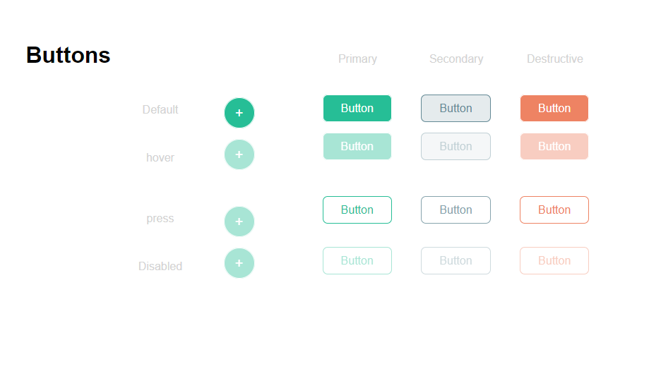

2022/04/28-2022/05/04

*buttons:-)
:-)The tag defines the relationship between the current document and an external resource. The tag is most often used to link to external style sheets or to add a favicon to your website.
:-)The tag defines a division or a section in an HTML document. The
tag is used as a container for HTML elements - which is then styled with CSS

:-) The tag in HTML document is used to create a line break in a text.

:-) The tag defines a paragraph of text. It is a block-level element and always starts on a new line.

:-) The tag defines a hyperlink, which is used to link from one page to another. The most important attribute of the element is the href attribute, which indicates the link's destination.

*class=
:-) A CSS class is an attribute used to define a group of HTML elements in order to apply unique styling and formatting to those elements with CSS.

*id 
:-) The id global attribute defines an identifier (ID) which must be unique in the whole document. Its purpose is to identify the element when linking (using a fragment identifier), scripting, or styling (with CSS).

*Hover
:-) hover selector is used. to select elements when you mouse over them.
